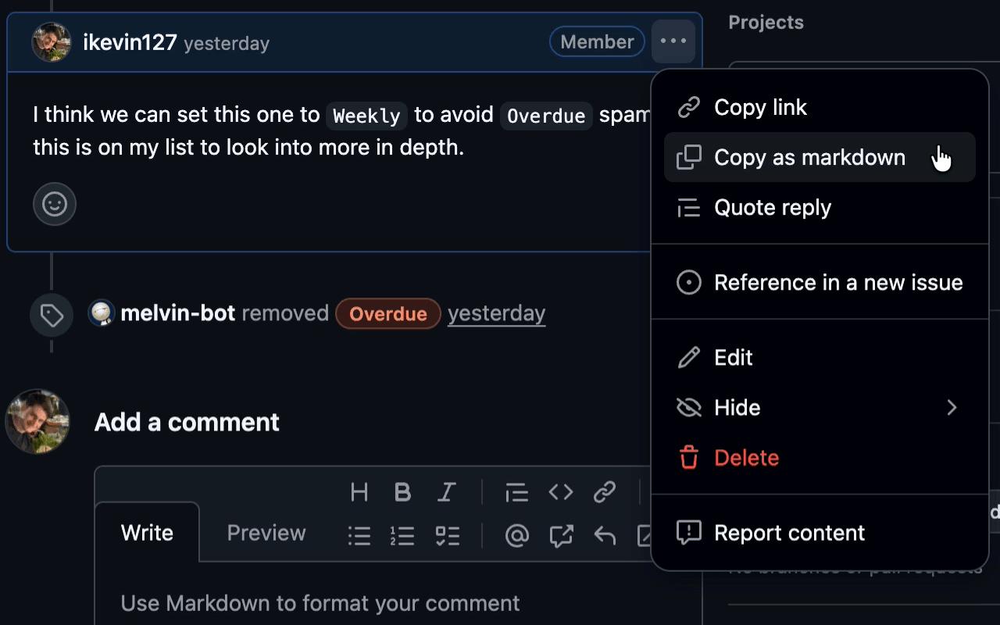

# GitHub - Copy as Markdown Chrome Extension



**Stop manually re-formatting code blocks and links.**

GitHub Copy as Markdown seamlessly adds a native-feeling "Copy as markdown" option to the (...) three-dot menu on every comment, issue description, and pull request review.

Whether you are moving a discussion to a new ticket, quoting a comment in a different app (like Slack, Jira, or Notion), or just saving snippets for later, this extension ensures you get the exact raw Markdown—not broken text.

🔥 Key Features:
- **Universal Support:** Works on Issues, Pull Requests, Reviews, Discussions, and main descriptions.
- **Smart Formatting:**
  - **Code Blocks:** Preserves language syntax (e.g., ```javascript).
  - **Task Lists:** Correctly formats checked `- [x]` and unchecked `- [ ]` boxes.
  - **Links & Images:** Keeps the original Markdown syntax.
- **Native Integration:** Injects a button directly into GitHub's existing "..." dropdown menus. It looks and feels like a built-in feature.

**Works Everywhere:**
- ✅ Logged in or Logged out (Incognito).
- ✅ Open or Closed/Merged PRs.
- ✅ New React-based views and legacy views.
- ✅ Locked threads where "Quote reply" is disabled.

## How to use
1. Click the `(...)` three-dot menu on any GitHub comment or description.
2. Select "Copy as markdown".
3. The raw markdown is instantly copied to your clipboard.
4. You will see a green flash on the comment visually confirming the copy.

## Privacy & Permissions
- `clipboardWrite`: Required to save the text to your clipboard.
- `activeTab` / Host Permissions: Required to detect GitHub pages and insert the button.
- **No Tracking:** This extension runs entirely locally in your browser. No data is sent to any external server.

## Version 2026.1
- Initial release with support for Issues and PRs.
- Advanced DOM detection for React-based views.
- Smart fallback for static/logged-out pages.
